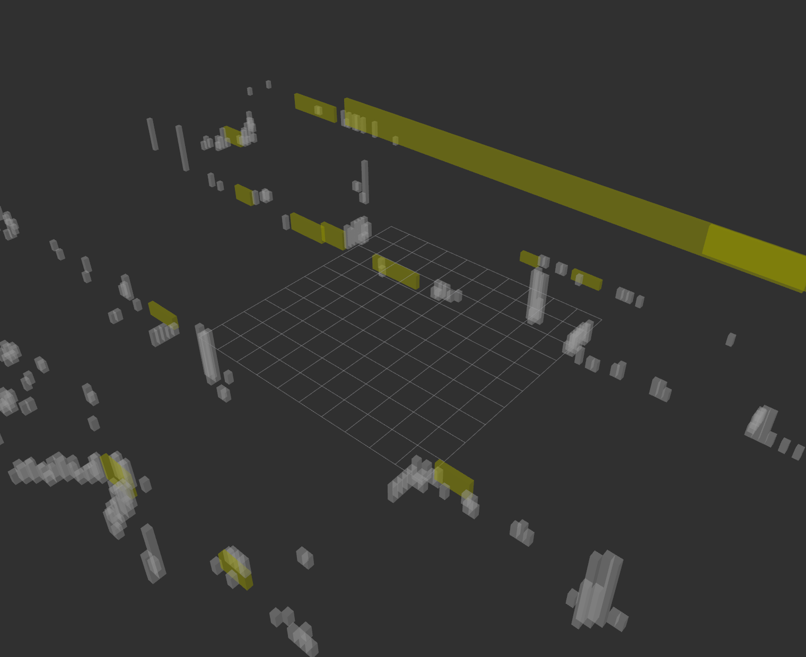
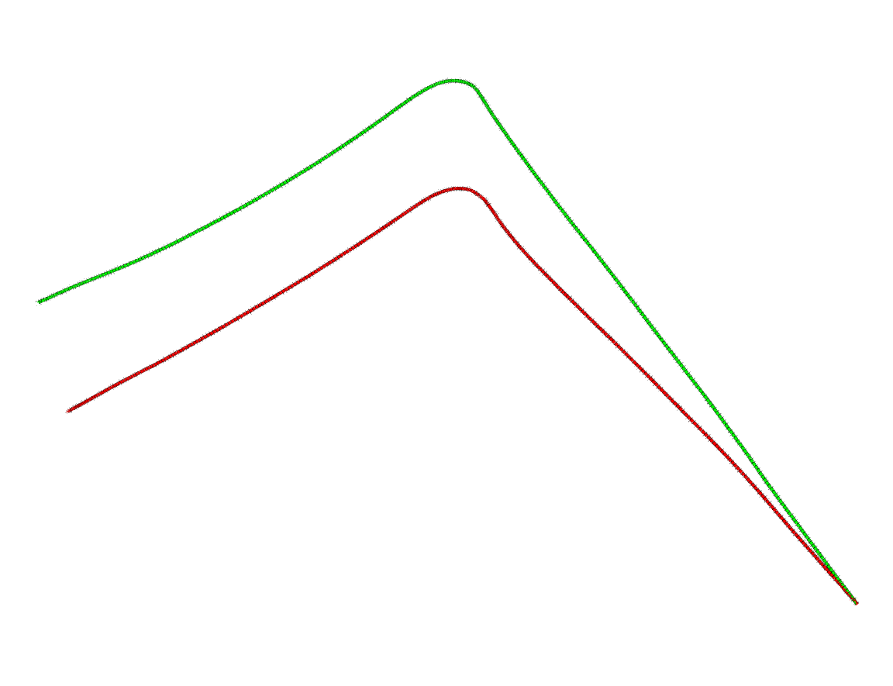

# 도심 환경에서 수직 방향 랜드마크를 활용한 ICP 알고리즘

정성민 (sm18570@yonsei.ac.kr)

## 목차

1. 서론
2. 연구 방법
   1. 데이터 전처리
      1. 복셀화 및 해시 함수
      2. 수직선 및 평면 추출
   2. 제안 방법
      1. 다운샘플링
      2. Closest Point 찾기
      3. 변환 행렬 계산
      4. 병합
3. 실험
   1. 실험 환경
      1. 하드웨어
      2. 데이터셋
      3. 베이스라인
   2. 평가 지표
   3. 결과
   4. 절제 연구 (Ablation Study)
4. 결론

 

## 1. 서론

ICP(Iterative Closest Point) 알고리즘 [1]은 두 개의 3D point cloud 데이터 점군을 매칭하는 알고리즘으로, pose estimation, loop closure 등에 사용된다. 두 점군의 각 점들을 매칭하여 변환 행렬을 찾아내는 알고리즘으로 안정적이고 강인하다고 알려져 있다. 하지만 점군의 크기가 클 경우 연산량이 매우 많아지며 local optimal solution에 쉽게 빠질 수 있다는 문제점이 있다. 또한 ICP 알고리즘이 6-DoF 변환을 모두 다룰 수 있는 것에 비해, 지상에서의 움직임은 로봇의 형태에 따라 그 자유도가 제한되어 있다. 따라서 로봇 이동의 자유도, 가속도, 회전 반경 등을 매칭에 반영하여 알고리즘을 효율적으로 개선한 연구가 활발히 진행되어 왔다 [3, 4].

이 연구는 도심 환경에서 움직이는 지상 로봇에 초점이 맞춰져 있다. 도심 속 가로등과 나무와 같이 높고 지면에 수직인 물체는 눈에 잘 띄는 효율적인 랜드마크로 사용된다는 것에서 착안했다. 높이가 높을수록 더 많은 프레임에서 그 랜드마크가 관측될 수 있기 때문에, 높은 랜드마크를 위주로 가중치를 두어 매칭을 한다면 모든 data point를 계산하지 않더라도 효율성과 정확도를 개선할 수 있을 것이라는 가설을 세웠다. 이에 따라, 3D point cloud 데이터에서 지면에 수직인 선과 면 성분을 고속으로 추출하고 이를 변환 행렬 계산 알고리즘에 반영하였다. 또한 단순 frame-to-frame 매칭이 아닌, 경우에 따라 몇 프레임 전 랜드마크라도 유지될 수 있도록 하여 랜드마크의 일관성을 향상시켰다. 그 결과, KITTI 데이터셋 [5]에서 ICP와 G-ICP 알고리즘에 비해 2배 이상 빠른 결과를 얻었고, sliding 현상을 크게 개선하여 pose 추정의 정확도를 높일 수 있었다.

 

## 2. 연구 방법

### 2.1. 데이터 전처리

데이터 전처리 과정에서는 3D point cloud로부터 지면에 수직인 선과 면 성분을 고속으로 추출한다. 지표면에서만 움직이는 로봇의 경우 높이가 있는 물체는 주변에 비해 뚜렷하게 구분되기 때문이다. 이러한 수직 성분들은 (x, y) 좌표와 높이로 분리되어 저장되고, 이후 2D ICP에 높이를 가중치로 취한 방식으로 매칭이 이루어진다. 이를 통해 z축 방향의 움직임은 추정할 수 없지만, 지상이나 실내 환경에서는 더욱 효율적이고 정확하게 pose 추정을 할 수 있다.

#### 2.1.1. 복셀화 및 해시 함수

3D point cloud를 복셀화한 후, 각 복셀의 좌표에 해시 함수를 적용하여 중복된 복셀을 제거하고 4바이트의 int 변수에 저장한다. 복셀의 크기는 한 변이 0.2m인 정육면체로 설정하였고, 복셀의 위치는 cluster-based가 아닌 grid-based로 설정하여 수직선과 면 추출을 용이하게 하였다. 해시 함수는 복셀의 x, y, z 좌표를 그대로 2진수로 변환하고 10비트씩 이어붙여 총 30비트의 int 변수로 변환하는 방식을 사용하였다. 이 방식을 통해 해시 충돌을 원천적으로 방지하면서 비트 연산만으로 연속된 복셀을 찾아낼 수 있다. 이때 이어붙이는 순서는 [y, x, z] 순서로 하였는데, 이는 2.1.2에서 설명할 수직선 및 면 추출 과정에서의 우선순위를 고려한 것이다.

$$
\text{hash} = (y \ll 20) + (x \ll 10) + z
$$

KITTI 데이터셋 9번 시퀀스의 첫 프레임을 복셀화한 결과는 아래와 같다. 우측 이미지는 복셀의 hash 값에 비례하여 색조를 변화시킨 것이다. [y, x, z] 순서로 hash 값을 이어붙였으므로, 좌우 방향인 y축 방향으로 색조가 가장 빠르게 변하며 높이 방향인 z축 방향으로는 색조가 거의 같은 것을 확인할 수 있다.

| Raw Point Cloud |    Voxelized    |
| :-------------: | :-------------: |
|  |  |

#### 2.1.2. 수직선 및 평면 추출

해시 함수를 적용한 복셀 데이터를 이용하여 매 프레임마다 z방향 수직선과 지표면에 수직인 평면을 추출한다. 우선 해시값을 기준으로 복셀을 정렬한다. 해시값의 최하위 10비트가 z좌표이므로, 해시값의 차이가 1인 복셀은 z축 방향으로 연속된 복셀이다. 따라서 비트 연산을 이용해 빠르게 연속인 복셀들을 찾아낸다. 이때, 수직선은 5개 이상의 연속된 복셀로 구성되어야 한다는 조건을 추가하여 높이가 1m 이상인 물체만을 선별했다. 이후, 수직선의 x, y 좌표만을 실제 매칭이 이루어지는 데이터로 저장하며 수직선의 높이는 매칭 과정에서 가중치로 활용되므로 따로 저장한다. 수직선을 이루지 못한 복셀들은 바닥면이나 중요도가 낮은 물체로 판단하여 제거한다. 아래와 같은 형식으로 Eigen Matrix와 Vector에 각각 저장한다.

$$
\begin{align*}
\text{Lines} & : \begin{bmatrix} x_1 & x_2 & \dots \\\\ y_1 & y_2 & \dots \end{bmatrix} \\\\
\text{Heights} & : \begin{bmatrix} h_1 \\\\ h_2 \\\\ \vdots \end{bmatrix}
\end{align*}
$$

평면 또한 수직선과 같은 방식으로 추출한다. 이때 x축과 나란한 평면만을 추출하는데, 로봇의 진행 방향인 x축과 나란한 평면은 sliding을 유발할 가능성이 가장 높기 때문이다. 이러한 평면을 하나의 개체로 저장하고 별도의 매칭 constrant를 적용함으로써 sliding을 효과적으로 방지한다. x축과 나란하지 않은 평면은 sliding을 적게 유발하므로 모든 각도의 평면을 추출하는 것보다 직접 매칭 과정에서 찾아내는 것이 효율적이라고 판단하였다.

해시값에 10만큼 right shift 연산을 적용하여 z좌표를 제거하고 x좌표를 최하위 10비트로 둔다. 이후 수직선 추출과 동일한 방식으로 해시값을 비교해 x축 방향으로 연속된 수직선을 찾아내고, 이를 평면이라는 하나의 개체로 묶는다. 평면이 시작하는 (x, y) 좌표와 끝나는 좌표, 평면을 이루는 수직선들의 평균 높이를 하나의 Eigen Matrix에 저장한다.

$$
\begin{align*}
\text{Planes} & : \begin{bmatrix} x_{1, start} & x_{2, start} & \dots \\\\ y_{1, start} & y_{2, start} & \dots \\\\ x_{1, end} & y_{2, end} & \dots \\\\ y_{1, end} & y_{2, end} & \dots \\\\ h_1 & h_2 & \dots \end{bmatrix} \\\\
\end{align*}
$$

KITTI 데이터셋 9번 시퀀스의 첫 프레임에서 수직선과 평면을 추출한 결과는 아래와 같다. 수직선은 흰색, 평면은 노란색으로 표시되었으며, 좌측 이미지는 수직선만 추출했을 때의 결과, 우측 이미지는 수직선과 평면을 모두 추출했을 때의 결과이다. 상단의 긴 평면의 경우 하나의 평면이 수직선 수십 개를 대체하고 있음을 확인할 수 있다.

|   Only Lines    | Lines and Planes |
| :-------------: | :--------------: |
|  |   |

### 2.2. 제안 방법

3차원 공간을 다루지만 2차원 ICP 알고리즘을 변형한 방식을 사용한다. 수직선과 평면을 각각 2차원에서의 점과 선으로 간주하고, 높이는 가중치로 취하여 매칭을 진행한다. 앞으로의 설명에서 편의를 위해 수직선-수직선 매칭은 점대점, 수직선-평면 매칭은 점대선 매칭으로 칭하도록 하겠다. 평면을 구성하는 수직선들 각각에 대해 매칭 여부를 계산하는 것이 아니라 평면이라는 하나의 객체에 대해 판단하기 때문에 정확도와 효율성을 동시에 확보할 수 있다.

#### 2.2.1. 다운샘플링

약 10만 개의 data point로 이루어진 point cloud의 경우 수백 개의 수직선들이 추출된다. 차원의 감소까지 고려하면 연산량이 큰 폭으로 줄어들지만 실시간성을 확보하기 위해서는 다운샘플링이 필요하다. 실험 결과 가장 효율적인 비율인 10%를 적용하여 매 iteration마다 원본 데이터에서 새롭게 다운샘플링을 진행한다. 이때 수직선에 대해서만 다운샘플링을 진행한다.

#### 2.2.2. Closest Point 찾기

다운샘플링된 현재 프레임과 직전 프레임간 거리가 가장 가까운 점들의 쌍을 찾는다. 이때 직전 프레임의 경우 로봇 위치를 중심으로 50m 반경 내의 점과 선만을 이용한다. 점대점 거리 비교는 2차원에서의 ICP과 동일하다. 현재 프레임의 점 각각에 대하여 직전 프레임의 모든 점까지의 거리를 계산하고, 거리가 가장 가까운 쌍을 찾는다. 점대선 거리 비교의 경우, 현재 프레임의 각 점에서 map의 모든 선에 내린 수선의 발까지의 거리를 비교한다. 이때 수선의 발이 해당 선을 벗어난 위치에 있을 경우 그 선은 무시한다. 이후 점으로부터 수선의 발까지의 거리가 가장 가까운 선을 찾는다. 최종적으로 점대점 거리와 점대선 거리를 비교하여 점대점 거리가 더 작을 경우 해당 점을, 점대선 거리가 더 가까운 경우 수선의 발의 위치를 closest point로 선택한다. 아래와 같이 현재 프레임의 점들은 $\mathbf{X}$, 직전 프레임의 점들은 $\mathbf{Y}$로 표기한다.

$$
\begin{align*}
\mathbf{X} & = \{ x_1, \ x_2, \dots, \ x_n\} \\\\
\mathbf{Y} & = \{ y_1, \ y_2, \dots, \ y_n\}
\end{align*}
$$

#### 2.2.3. 변환 행렬 계산

다운샘플링된 현재 프레임의 모든 점에 대하여 closest point를 찾았다면, Singular Value Decomposition을 이용하여 두 점군 간의 변환 행렬을 계산할 수 있다. 이때 계산 과정에서 수직선과 평면의 높이가 가중치로 활용된다. 물체의 높이가 높을수록 그 안에 포함되는 라이다 data point들도 많으므로, 일반 ICP에서 각 data point들을 모두 계산한 것과 같은 효과를 내기 위함이다.

우선 outlier rejection을 위해 두 점 사이의 거리가 상위 10%인 쌍을 매칭에서 제외된다. 이후 아래의 수식을 이용하여 현재 프레임과 직전 프레임의 무게중심을 계산한다. 이 단계에서는 수직선과 평면의 높이를 가중치로 취하지 않는 것이 정확도가 더 높은 것으로 나타났다.

$$
\begin{align*}
x_0 & = \frac{1}{N} \sum_{i=1}^{N} x_i \\\\
y_0 & = \frac{1}{N} \sum_{i=1}^{N} y_i
\end{align*}
$$

이후 각 점에 대해 무게중심의 좌표를 빼줌으로써 각 점의 중심이 원점에 위치하도록 한다.

$$
\begin{align*}
x_i - x_0 \\\\
y_i - y_0
\end{align*}
$$

이제 $\mathbf{X}$와 $\mathbf{Y}$간의 covariance matrix $\mathbf{H}$를 계산한다. 이때 수직선과 평면의 높이를 가중치 벡터 $\mathbf{h}$로 취하여 계산에 반영한다.

$$
\begin{gather*}
\mathbf{h} = \begin{bmatrix} h_1 \\\\ h_2 \\\\ \vdots \\\\ h_n \end{bmatrix} \\\\
\mathbf{H} = \sum h_i(\mathbf{x}_i - \mathbf{x}_0)(\mathbf{y}_i - \mathbf{y}_0)^T = \mathbf{X} \cdot diag(\mathbf{h}) \cdot \mathbf{Y} \\\\
\end{gather*}
$$

계산된 covariance matrix $\mathbf{H}$를 Singular Value Decomposition하여 회전 행렬 $\mathbf{R}$과 변환 벡터 $\mathbf{t}$를 계산한다.

$$
\begin{align*}
\mathbf{H} & = \mathbf{U} \mathbf{D} \mathbf{V}^T \\\\
\mathbf{R} & = \mathbf{V} \mathbf{U}^T \\\\
\mathbf{t} & = \mathbf{y}_0 - \mathbf{R} \mathbf{x}_0
\end{align*}
$$

#### 2.2.4. 병합

변환 행렬을 이용하여 현재 프레임의 점들을 직전 프레임의 좌표계로 변환하고, 이를 직전 프레임의 점들과 비교한 후 다음 프레임의 점들로 저장한다. 이때 병합은 점과 선에 대해 다르게 수행한다.

점의 경우, 새롭게 들어오려는 점의 근처에 기존 점이 있을 경우 새로운 점을 추가하는 대신 기존의 점을 유지한다. 이는 iteration이 진행되면서 새로운 점이 기존 점에 근접할 수는 있지만 기존 점을 지나쳐 갈 수는 없기 때문이다. 따라서 새로운 점으로 기존 점을 교체한다면 점점 점의 위치가 진행 방향의 뒤로 밀려날 수밖에 없다. 이러한 sliding 현상을 방지하기 위해 기존 점을 유지하는 방식을 취한다. 마찬가지로 새롭게 들어오려는 점의 근처에 기존 선이 있을 경우 새로운 점을 버리고 기존 선을 택한다. 그 외에는 기존 점을 모두 제거하고 새로운 점으로 프레임을 구성한다.

선의 경우, 새로운 선이 기존 선과 만나는 경우의 수가 크게 세 가지로 구분된다.

1. 새로운 선이 기존 선에 포함되는 경우
2. 기존 선이 새로운 선에 포함되는 경우
3. 새로운 선이 기존 선을 연장하는 경우

첫 번째 경우는 새로운 선을 추가하지 않고 기존 선을 유지하고, 두 번째 경우는 새로운 선으로 기존 선을 교체한다. 세 번째 경우는 두 선의 위치 관계에 따라 두 선을 연결하여 하나의 선으로 만든다. 이때 새로운 선의 높이는 두 선의 평균 높이로 정한다. 이 3가지 방식으로 기존 선과 새로운 선의 상호작용이 있는 경우, 기존 선에 변함이 없는 1번의 경우라 할지라도 다음 프레임에 기존 선이 유지된다. 이러한 방식을 통해 수직선과 평면의 일관성을 유지하고 sliding 현상을 방지할 수 있다.

|       Step 1       |       Step 2       |       Step 3       |       Step 4       |
| :----------------: | :----------------: | :----------------: | :----------------: |
|  |  |  |  |

위 사진은 선의 병합 과정을 보여준다. Step 1에서는 물체의 가로 방향 경계면이 여러 개의 선으로 나타나다가, 로봇이 방향을 틀면서 하나의 선으로 병합된다. 분홍색 선이 새로 들어오는 선, 노란색 선이 기존 선을 나타낸다. 새로운 선이 별개였던 기존 선들을 연결해 주면서 점차 하나의 선으로 병합되고, 마지막 step에서는 한번도 나타나지 않은 가로로 긴 노란색 선이 나타나는 것을 확인할 수 있다. 이러한 병합 알고리즘을 통해 물체의 위치에 선을 정확히 위치시키고 오래 유지할 수 있다.

 

## 3. 실험

### 3.1. 실험 환경

#### 3.1.1. 하드웨어

본 연구에서는 8GB RAM이 장착된 Intel Core i7 CPU를 사용하였다.

#### 3.1.2. 데이터셋

본 연구는 KITTI 데이터셋을 이용하여 실험을 진행하였다. KITTI 데이터셋은 도심 환경에서 촬영된 라이다 데이터로, 자율주행차나 지상 로봇의 pose estimation 등에 널리 사용되는 데이터셋이다. 본 연구에서는 KITTI 데이터셋의 09번 시퀀스를 사용하였다.

#### 3.1.3. 베이스라인

본 연구에서는 ICP 알고리즘 [1]과 G-ICP 알고리즘 [2]을 베이스라인으로 삼았다. 둘 모두 PCL 라이브러리에 이미 구현된 함수를 이용하였고, 복셀화나 수직선 추출 없이 point cloud 자체를 이용했다. 공정한 비교를 위하여 본 연구에서 제안한 알고리즘과 동일한 10%의 비율로 random downsampling을 적용하였다.

### 3.2. 평가 지표

본 연구의 baseline은 기존의 3D ICP 알고리즘으로 정했다. 평가 지표로는 프레임당 평균 처리 속도와, 추정된 pose와 ground truth pose 사이의 Euclidean 거리를 사용하였다. 두 pose 간의 거리는 아래의 수식으로 계산하였다.

$$
E_{pose} = \Vert \mathbf{t_{est}} - \mathbf{t_{gt}} \Vert
$$

### 3.3. 결과

|   Method   |         제안 방법         |          ICP          |         G-ICP          |
| :--------: | :-----------------------: | :-------------------: | :--------------------: |
|    Path    |  |  |  |
| Avg. Time  |           0.526           |         1.338         |         1.212          |
| Avg. Error |           1.496           |        39.431         |         38.455         |

위 이미지에서 초록색 선은 Ground Truth Pose, 빨간색 선은 알고리즘으로 추정한 Pose를 나타낸다. 위 표와 같이 본 연구에서 제안한 알고리즘을 3D ICP 및 3D G-ICP 알고리즘과 비교하였다. 본 연구에서 제안한 알고리즘은 속도 측면에서는 ICP와 G-ICP보다 2배 이상 높았다. 정확도 측면에서는, 초반 각도 틀어짐으로 인한 오차를 감안하더라도 ICP와 G-ICP 모두에서 rotation과 translation 오차가 유의미하게 발생했다. ICP와 G-ICP의 경우 초반 sliding으로 인해 정확한 rotation을 추정하지 못했다. 이는 수직선과 평면을 이용하여 중요한 물체를 집중적으로 매칭하는 것이 단순하게 모든 점들을 이용하는 매칭보다 효율적이고 정확하다는 것을 보여준다.

 
 
 
 
 

|     Elapsed Time      |         Error          |
| :-------------------: | :--------------------: |
|  |  |

위 그래프는 앞의 세 방식에 대해 프레임별 소요 시간과 정확도를 나타낸다. Outlier가 있기는 하나, 대부분의 구간에서 본 연구에서 제안한 알고리즘이 가장 빠른 속도를 보였다. 특히, Sequence 초반에 나타나는 벽들에 대해 sliding 현상을 방지하여 더욱 높은 정확도를 보였다.

### 3.4. 절제 연구 (Ablation Study)

본 연구에 적용한 변형 ICP 알고리즘의 각 요소가 pose 추정에 미치는 영향을 살펴보기 위해 절제 연구를 진행하였다. 아래 이미지에서 초록색 선은 Ground Truth Pose, 빨간색 선은 알고리즘으로 추정한 Pose를 나타낸다.

|   Method   |         제안 방법         |        1. Without Line-Plane Matching         |  2. Without Plane Merging   |      3. Without Plane Extraction      |
| :--------: | :-----------------------: | :-------------------------------------------: | :-------------------------: | :-----------------------------------: |
|    Path    |  |  |  |  |
| Avg. Time  |           0.526           |                     0.483                     |            0.635            |                 0.828                 |
| Avg. Error |           1.496           |                    11.807                     |            8.614            |                27.127                 |

1. 수직선-평면 매칭을 하지 않은 경우

수직선-평면 매칭의 효과를 알아보기 위하여, 평면 추출은 진행하되 평면에 수선의 발을 내린 후 길이를 비교하는 과정을 생략하고 수직선-수직선 거리 비교만을 진행한 경우이다. 수직선-평면 매칭의 경우 진행 방향에 수직인 방향으로 매칭되려는 힘을 가하게 되므로, 수직선-평면 매칭을 생략할 경우 그림과 같이 왼쪽으로 sliding하는 현상이 발생한다.

2. 평면 병합을 하지 않은 경우

평면 병합을 통해 단순히 직전 프레임의 평면만을 이용하는 것이 아닌 여러 프레임의 평면 정보를 종합하여 더 넓은 평면을 추출하거나 오차를 보정할 수 있다. 평면 병합을 하지 않은 경우 오차율이 더 높아지는 것을 위 표를 통해 확인할 수 있다.

3. 평면 추출을 하지 않은 경우

평면 추출을 하지 않은 경우, 수직선만을 이용하여 pose 추정을 진행하였다. 이 경우 평면을 구성하고 있는 수직선 각각에 대해 closest point 계산을 수행하므로 계산량이 훨씬 증가한다. 그뿐 아니라 x축 방향의 직선의 경우, 자동차가 x축 방향으로 이동하더라도 feature의 이동이 없으므로 이동이 없다고 인식하는 sliding 현상이 발생한다. Sequence 초반에 자동차 좌우로 긴 벽이 있어 sliding 현상이 크게 발생하였는데, 이로 인해 좌회전을 하는 위치가 크게 차이나는 것을 확인할 수 있다.

 

## 4. 결론

본 연구에서는 3D point cloud 데이터에서 수직선과 평면을 추출하여 2D ICP 알고리즘과 유사한 방식으로 pose 추정을 하는 알고리즘을 제안하였다. 평면 추출을 통해 계산해야 할 데이터의 양을 획기적으로 감소시키며 동시에 강인함까지 얻을 수 있었다. 기존의 3D ICP 알고리즘에 비해 sliding 현상을 개선하면서 2배 빠른 속도를 보였으며, KITTI 데이터셋을 이용한 실험을 통해 그 효과를 입증하였다. 또한, 수직선-평면 매칭, 평면 병합, 평면 추출 등의 요소가 pose 추정에 미치는 영향을 살펴보기 위한 절제 연구를 진행하였다. 실험 결과, 수직선-평면 매칭과 평면 병합이 pose 추정에 큰 영향을 미치는 것을 확인할 수 있었다. 앞으로는 더욱 정확한 pose 추정을 위해 평면-평면 매칭과 더 효율적인 평면 병합 방법을 연구할 예정이다. 코드 최적화와 GPU 가속을 통해 실시간성을 확보하고 보다 다양한 데이터셋을 통해 알고리즘의 일반성을 검증할 예정이다.

 

## 참고문헌

1. Besl, P. J., & McKay, N. D. (1992). A method for registration of 3-D shapes. IEEE Transactions on pattern analysis and machine intelligence, 14(2), 239-256.
2. Segal, A., Haehnel, D., & Thrun, S. (2009). Generalized-ICP. In Robotics: Science and Systems (Vol. 2, pp. 435-442).
3. Ignacio Vizzo, Tiziano Guadagnino, Benedikt Mersch, Louis Wiesmann, Jens Behley, and Cyrill Stachniss. KISS-ICP: In Defense of Point-to-Point ICP – Simple, Accurate, and Robust Registration If Done the Right Way. IEEE Robotics and Automation Letters (RA-L), 8(2):1–8, 2023.
4. A. Censi, ‘‘An ICP variant using a point-to-line metric,’’ in Proc. IEEE Int. Conf. Robot. Autom., Pasadena, CA, USA, May 2008, pp. 19–25.
5. Andreas Geiger, Philip Lenz, and Raquel Urtasun. Are we ready for Autonomous Driving? The KITTI Vision Bench-mark Suite. In Proc. of the IEEE Conf. on Computer Vision and Pattern Recognition (CVPR), 2012.
